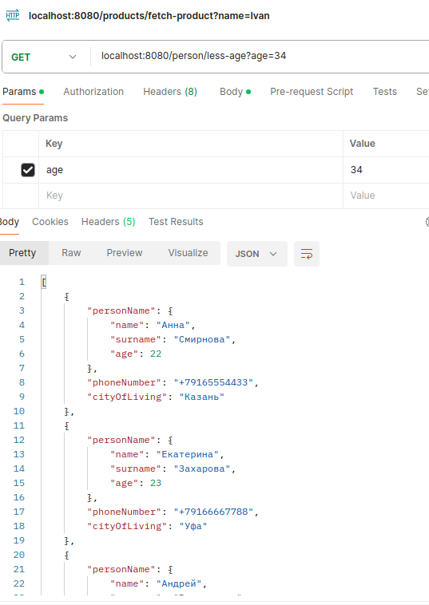

# Hibernate

1) Для локального тестирвоания необходимо запустить докер компоуз
`docker-compose up -d`
2) Далее загрузить все необходимые зависимости через maven
3) Запустить приложение, таблицы он создаст самостоятельно 
4) Самосоятельно подготовить выборку данных для локального тестирования
5) Запросить через GET список всех пользователей которые живут в городе Москва
`GET localhost:8080/persons/city?city=Москва`

проверим возраст, вернуть должен меньше указанного с сортировкой
`GET localhost:8080/person/less-age?age=34`

`GET localhost:8080/person/name-surname?name=Анна&surname=Смирнова`
